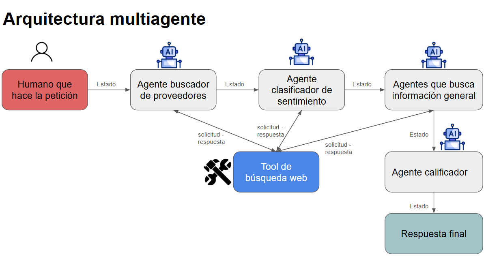

# 🤖 Sistema Multi-Agente de Gestión de Proveedores

## 📋 Descripción del Proyecto

Este proyecto es un **sistema inteligente de investigación y calificación de proveedores** que utiliza una arquitectura multi-agente orquestada con LangGraph. El sistema automatiza el proceso completo de búsqueda, análisis y evaluación de proveedores comerciales basándose en criterios específicos del usuario.

### ¿Por qué este proyecto?

En el mundo empresarial, encontrar el proveedor adecuado requiere investigar múltiples aspectos: disponibilidad, reputación, métodos de pago, promociones y opiniones de clientes. Este proceso manual consume tiempo y recursos. Este sistema automatiza completamente esta tarea mediante agentes especializados que trabajan en conjunto para proporcionar una evaluación objetiva y completa.

## 🎯 Características Principales

- **Búsqueda Inteligente**: Encuentra automáticamente proveedores relevantes según la solicitud del usuario
- **Análisis de Sentimiento**: Evalúa opiniones de clientes para determinar la reputación del proveedor
- **Extracción de Información**: Obtiene datos clave como métodos de pago, promociones, contacto y ubicación
- **Sistema de Calificación**: Genera puntuaciones objetivas basadas en múltiples criterios
- **Arquitectura Modular**: Cada agente es independiente y especializado en una tarea específica
- **Manejo de Errores Robusto**: Sistema de reintentos automáticos para garantizar resultados confiables

## 🏗️ Arquitectura del Sistema

El proyecto utiliza un **patrón de arquitectura multi-agente orquestado** con LangGraph, donde cada agente es un nodo especializado en el grafo de ejecución:



### Flujo de Trabajo

1. **Agente Busca Proveedores** (`ag_busca_prov.py`)
   - Recibe la solicitud del usuario
   - Busca en la web usando DuckDuckGo
   - Retorna lista de 3 proveedores con sus páginas web

2. **Agente Analiza Sentimiento** (`ag_analiza_sent.py`)
   - Recibe la lista de proveedores
   - Busca opiniones de clientes en la web
   - Clasifica el sentimiento: Positivo, Neutro o Negativo

3. **Agente Info General** (`ag_busca_info_gen.py`)
   - Extrae información detallada de cada proveedor
   - Obtiene: métodos de pago, promociones, teléfono y dirección
   - Valida la información encontrada

4. **Agente Calificador** (`ag_calificador.py`)
   - Consolida toda la información recopilada
   - Genera calificaciones numéricas por criterio
   - Calcula una puntuación total para cada proveedor

## 🛠️ Tecnologías Utilizadas

### Framework y Orquestación
- **LangGraph** (v1.0.3): Orquestación del flujo de agentes mediante grafos de estado
- **LangChain** (v1.0.5): Framework base para construcción de agentes LLM
- **LangChain Community** (v0.4.1): Herramientas comunitarias, incluyendo DuckDuckGo Search

### Modelos de Lenguaje
- **Anthropic Claude** (v0.72.1):
  - Claude 3.5 Haiku: Para búsqueda de proveedores, info general y calificación
  - Claude 3.7 Sonnet: Para análisis de sentimiento (tarea más compleja)

### Validación y Estructuración
- **Pydantic** (v2.12.4): Validación de datos y definición de esquemas de salida
- **Pydantic Settings** (v2.12.0): Gestión de configuración

### Herramientas de Búsqueda
- **DuckDuckGo Search** (v8.1.1): Motor de búsqueda sin necesidad de API key
- **DDGS** (v9.9.1): Cliente alternativo para DuckDuckGo

### Manejo de Errores y Reintentos
- **Tenacity** (v9.1.2): Sistema de reintentos con backoff exponencial
- Configuración personalizada: 3 intentos con espera de 2 segundos

### Utilidades
- **Python-dotenv** (v1.2.1): Gestión de variables de entorno
- **Logging**: Sistema de logs detallado para debugging

## 📁 Estructura del Proyecto

```
agent_projects/
│
├── gest_prov/                    # Paquete principal
│   ├── agentes/                  # Módulo de agentes especializados
│   │   ├── ag_busca_prov.py     # Agente de búsqueda de proveedores
│   │   ├── ag_analiza_sent.py   # Agente de análisis de sentimiento
│   │   ├── ag_busca_info_gen.py # Agente de información general
│   │   └── ag_calificador.py    # Agente calificador final
│   │
│   ├── config/                   # Configuración del sistema
│   │   ├── estados.py           # Definición del estado compartido
│   │   └── retry.py             # Lógica de reintentos
│   │
│   ├── tools/                    # Herramientas reutilizables
│   │   └── buscador_web.py      # Tool de búsqueda en DuckDuckGo
│   │
│   ├── main.py                   # Punto de entrada (vacío, para expansión)
│   └── orquestacion.py          # Orquestador principal con LangGraph
│
├── requirements.txt              # Dependencias del proyecto
├── .gitignore                   # Archivos ignorados por Git
└── README.md                    # Este archivo
```

## 🚀 Instalación y Configuración

### Prerrequisitos
- Python 3.10 o superior
- Cuenta de Anthropic con API key

### Pasos de Instalación

1. **Clonar el repositorio**
```bash
git clone <url-del-repositorio>
cd agent_projects
```

2. **Crear entorno virtual**
```bash
python -m venv venv
```

3. **Activar entorno virtual**
```bash
# Windows
venv\Scripts\activate

# Linux/Mac
source venv/bin/activate
```

4. **Instalar dependencias**
```bash
pip install -r requirements.txt
```

5. **Configurar variables de entorno**

Crear un archivo `.env` en la raíz del proyecto:
```env
ANTHROPIC_API_KEY=tu_api_key_aqui
```

## 💻 Uso del Sistema

### Ejecución Básica

```bash
python gest_prov/orquestacion.py
```

### Personalizar la Búsqueda

Edita el archivo `orquestacion.py` en la línea 61-62 para cambiar la solicitud:

```python
salida = app.invoke(Estado(
    solicitud_usuario="necesito buscar los mejores proveedores de llantas de autos de gama media en medellín, "
                     "me interesan aquellos que ofrezcan pago a crédito y tengan buenas promociones"
))
```

### Ejemplo de Salida

```json
{
  "solicitud_usuario": "necesito buscar los mejores proveedores de llantas...",
  "lista_proveedores": [
    {
      "proveedor": "Llantas Express",
      "pagina_web": "https://llantasexpress.com"
    }
  ],
  "sentimientos": [
    {
      "proveedor": "Llantas Express",
      "categoria_sentimiento": "Positivo"
    }
  ],
  "info_general": [
    {
      "pagina_web": "https://llantasexpress.com",
      "tel_contacto": "+57 300 123 4567",
      "direccion": "Calle 50 #45-23, Medellín",
      "metodos_pago": "Efectivo, Tarjeta, Crédito",
      "principales_promociones": "20% descuento en segunda llanta"
    }
  ],
  "calificaciones": [
    {
      "pagina_web": "https://llantasexpress.com",
      "sentimiento": "Positivo",
      "calif_sentimiento": 3,
      "metodos_pago": "Efectivo, Tarjeta, Crédito",
      "calif_metodos_pago": 4,
      "principales_promociones": "20% descuento",
      "calif_promociones": 4,
      "calificacion_total": 11
    }
  ]
}
```

## 🎨 Decisiones de Diseño

### ¿Por qué LangGraph?

LangGraph permite definir flujos de trabajo complejos como grafos de estado, donde cada nodo es un agente independiente. Esto proporciona:
- **Modularidad**: Cada agente puede desarrollarse y probarse independientemente
- **Escalabilidad**: Fácil agregar nuevos agentes al flujo
- **Trazabilidad**: El historial de pasos permite debugging efectivo
- **Flexibilidad**: Posibilidad de crear flujos condicionales en el futuro

### ¿Por qué múltiples agentes en lugar de uno solo?

1. **Especialización**: Cada agente se enfoca en una tarea específica, mejorando la calidad
2. **Reutilización**: Los agentes pueden usarse en otros flujos
3. **Mantenibilidad**: Más fácil actualizar o mejorar un agente específico
4. **Paralelización futura**: Arquitectura preparada para ejecución paralela

### ¿Por qué diferentes modelos de Claude?

- **Claude 3.5 Haiku**: Rápido y económico para tareas de búsqueda y extracción
- **Claude 3.7 Sonnet**: Más potente para análisis de sentimiento, que requiere comprensión contextual profunda

### Sistema de Reintentos

El decorador `@retry` de Tenacity garantiza robustez ante:
- Errores de validación de formato
- Problemas temporales de red
- Respuestas incompletas del LLM

## 🔧 Configuración Avanzada

### Modificar el número de proveedores

En `ag_busca_prov.py`, línea 22:
```python
proveedores : list[Proveedores] = Field(description="Lista de maximo 3 proveedores...")
```

### Ajustar criterios de calificación

En `ag_calificador.py`, líneas 53-56:
```python
1) Calificar el sentimiento de 1 a 3
2) Calificar metodos de pago, de 1 a 5
3) Calificar las promociones, de 1 a 5
```

### Cambiar parámetros de reintento

En `config/retry.py`, líneas 4-7:
```python
@retry(
    stop=stop_after_attempt(3),  # Número de intentos
    wait=wait_fixed(2),          # Segundos entre intentos
)
```

## 📊 Características Técnicas Destacadas

### Estado Compartido Tipado

Uso de Pydantic para definir un estado compartido fuertemente tipado que fluye entre agentes:

```python
class Estado(BaseModel):
    solicitud_usuario: str
    lista_proveedores: Optional[List[Dict[str, Any]]]
    sentimientos: Optional[List[Dict[str, Any]]]
    info_general: Optional[List[Dict[str, Any]]]
    calificaciones: Optional[List[Dict[str, Any]]]
    historial_pasos: Optional[list[str]]
```

### Validación Estructurada de Salidas

Cada agente define su esquema de salida con Pydantic, garantizando consistencia:

```python
class Proveedores(BaseModel):
    proveedor: str = Field(description="Proveedor que vende el producto buscado")
    pagina_web: str = Field(description="Pagina web del proveedor")
```

### Logging Detallado

Sistema de logging configurado para facilitar debugging:
```python
logging.basicConfig(level=logging.INFO, format='%(asctime)s - %(name)s - %(levelname)s - %(message)s')
langchain.debug = True
```

## 🌟 Casos de Uso

Este sistema es ideal para:

- **Empresas B2B**: Automatizar la búsqueda de proveedores industriales
- **E-commerce**: Encontrar distribuidores de productos específicos
- **Startups**: Investigación de mercado y análisis de competencia
- **Consultorías**: Generar informes de proveedores para clientes
- **Investigación**: Análisis comparativo de ofertas comerciales

## 🚧 Mejoras Futuras

- [ ] Implementar caché de resultados para búsquedas repetidas
- [ ] Agregar soporte para más motores de búsqueda (Google, Bing)
- [ ] Crear interfaz web con Streamlit o Gradio
- [ ] Implementar ejecución paralela de agentes independientes
- [ ] Agregar persistencia de resultados en base de datos
- [ ] Sistema de notificaciones por email con resultados
- [ ] API REST para integración con otros sistemas
- [ ] Dashboard de métricas y analytics

## 📝 Licencia

Este proyecto es parte de un portafolio personal y está disponible para fines educativos y de demostración.

## 👤 Autor

Desarrollado como proyecto de portafolio para demostrar habilidades en:
- Arquitectura de sistemas multi-agente
- Integración de LLMs (Large Language Models)
- Orquestación con LangGraph
- Diseño de software modular y escalable
- Manejo de APIs externas
- Validación de datos con Pydantic

---

**Nota**: Este proyecto demuestra competencias avanzadas en desarrollo de sistemas basados en IA, arquitectura de software y mejores prácticas de programación en Python.
